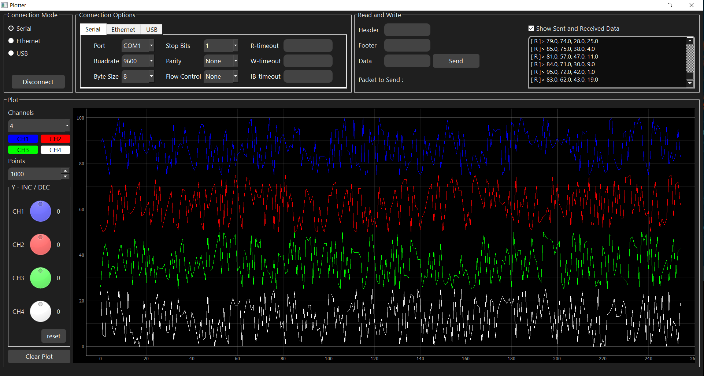

# plotter
**Dispaly real time data using pyqtgraph**

Send data via serial port.



**How to send data:**

In order to plot data correctly, send data space separated and add a newline character (\n) at the end.

for example:
```python
data = '52.8 70 21 100\n'
serial.write(data.encode())
```


**How to run:**

Install python, clone the repository and run the following commands in windows cmd:

```
$ pip install virtualenv
$ virtualenv plotter_venv
$ .\plotter_venv\Scripts\activate
$ pip install -r requirement.txt
$ python plotter.py
```
